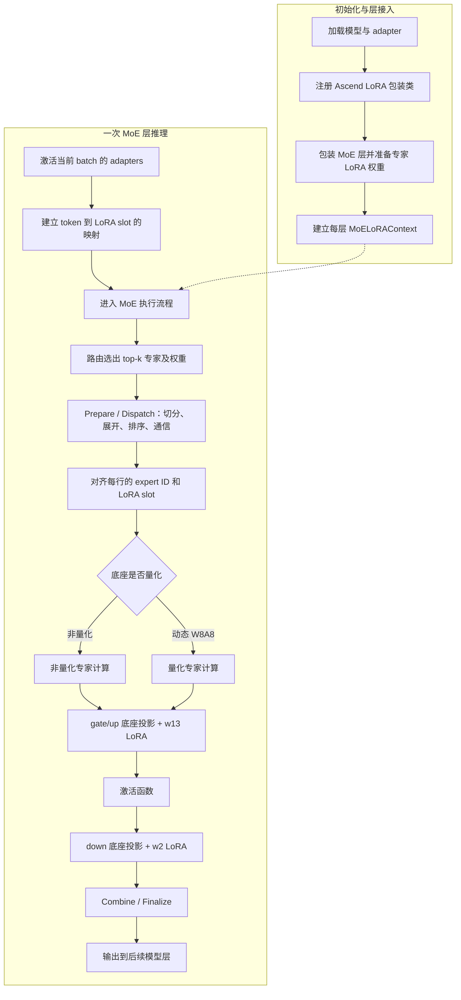
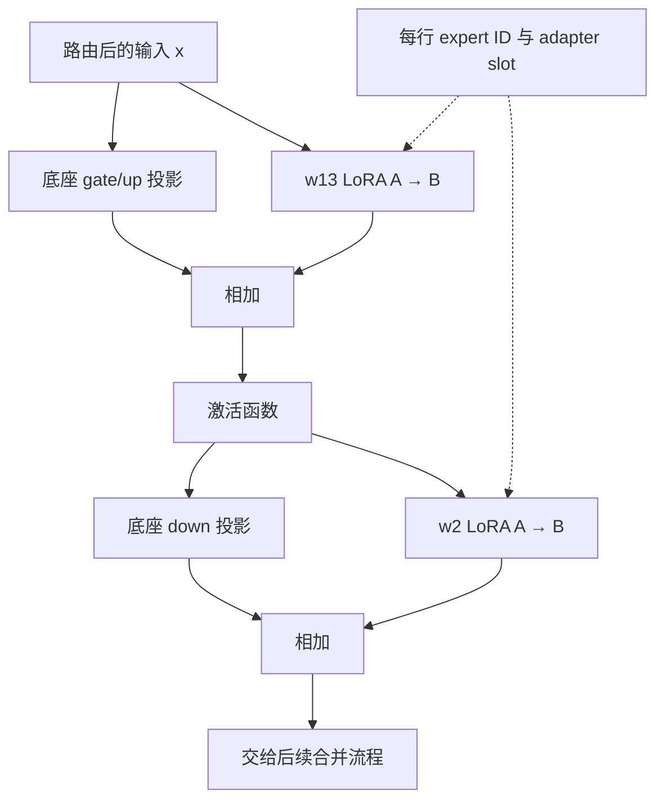

# vLLM Ascend MoE LoRA 代码阅读 Wiki

> 整理日期：2026-09-18  
> 源码仓库：`/Users/zhangfan/project/lora/vllm-ascend`  
> 对应 commit：`1a4d4e6bb156945156bfbfb64bf72f76fe0ef0d3`  
> 范围：本地当前版本的 MoE LoRA 推理实现。本文根据静态代码阅读整理，未执行 NPU 推理验证。源码链接指向本机文件；版本变化后请以函数名重新定位。

## 1. 先建立整体认知

MoE LoRA 沿用 Ascend 的 MoE 路由、专家计算和结果合并流程，在专家的 gate/up 与 down 两次投影中加入低秩增量。

理解实现需要抓住三个问题：

1. 当前计算行属于哪个 expert？
2. 当前计算行使用哪个 LoRA adapter？
3. 对应 LoRA 权重的计算结果应该加在哪里？

普通 dense LoRA 主要按 adapter 选择权重；MoE LoRA 还需要按 expert 选择权重。token 经过展开、排序和跨卡交换后，这两个索引必须始终与计算行对齐。

本文的主线是 routed experts。Shared experts 使用普通 dense LoRA wrapper。

## 2. 总体流程图



这是逻辑流程图，并非所有模型的逐函数调用栈。路由权重的实际应用位置要结合所选执行路径和 `topk_scales` 等字段阅读。

## 3. 模块地图

下表中的路径均相对于源码仓库根目录。

| 模块 | 文件 / 关键入口 | 职责 |
|---|---|---|
| Batch adapter 激活 | `vllm_ascend/worker/model_runner_v1.py`：`set_active_loras` | 激活当前请求使用的 adapters，复用上游映射管理 |
| NPU 后端入口 | `vllm_ascend/platform.py` | 指定 `PunicaWrapperNPU` |
| 包装类注册 | `vllm_ascend/lora/utils.py`：`refresh_all_lora_classes` | 将 Ascend MoE / dense LoRA 包装类注册到上游选择机制 |
| MoE LoRA 包装与辅助函数 | `vllm_ascend/lora/fused_moe.py` | 构建 context、处理映射、恢复逐行路由、调用 w13/w2 LoRA |
| MoE 层与专家执行 | `vllm_ascend/ops/fused_moe/fused_moe.py`、`routed_experts.py` | 接收 context，将其传入通信和专家计算流程 |
| 准备与收尾 | `vllm_ascend/ops/fused_moe/prepare_finalize.py` | 准备 token 布局及相应 LoRA 索引，完成输出收尾 |
| 通信组织 | `vllm_ascend/ops/fused_moe/moe_comm_method.py` | 将 context 传给 prepare/finalize 和 dispatcher |
| Token 分发 | `vllm_ascend/ops/fused_moe/token_dispatcher.py` | token 与 LoRA 索引的排序、交换、再排序 |
| MLP 分支选择 | `vllm_ascend/ops/fused_moe/moe_mlp.py` | 为活跃 LoRA 的量化 batch 选择专门实现 |
| 量化 LoRA | `vllm_ascend/lora/quant_moe.py` | 量化实现注册与动态 W8A8 专家计算 |
| LoRA 计算后端 | `vllm_ascend/lora/punica_npu.py`：`add_lora_fused_moe` | 按 adapter 与 expert 选择 A/B 权重并累加增量 |
| 算子接口 | `vllm_ascend/lora/lora_ops.py` | 调用 `_C_ascend` BGMV 算子 |
| 底层实现 | `csrc/kernels/bgmv_shrink.cpp`、`bgmv_expand.cpp` | LoRA 降维与升维计算 |

## 4. 初始化：权重与上下文如何接入

重点入口：[AscendFusedMoEWithLoRA](/Users/zhangfan/project/lora/vllm-ascend/vllm_ascend/lora/fused_moe.py)。

1. `PunicaWrapperNPU` 初始化时调用 `refresh_all_lora_classes`，注册 Ascend 包装类。
2. `AscendFusedMoEWithLoRA` 复用上游权重分配、`set_lora`、`reset_lora` 和切分能力，绕过上游 GPU 专用的构造与注入流程。
3. 包装类根据 MoE 自身的并行配置处理 TP/EP，不能简单用全局 TP 配置再次切分本地专家权重。
4. `set_mapping` 关联 Punica wrapper，通过 `_build_lora_context` 建立当前层的上下文，并调用底座层的 `set_lora_context` 发布。
5. 专家执行入口把 context 同步到通信方法和量化方法；执行结束后清理相应引用。

`AscendFusedMoE3DWithLoRA` 对应已经将 w1/w3 融合成 3D 权重的布局，w13 使用单 slice。普通包装类的 slice 数还取决于激活配置。

### 区分两种生命周期

| 信息 | 生命周期 / 含义 |
|---|---|
| w13/w2 的 LoRA A/B 权重 | 层持有的 adapter 权重，随 adapter 加载和重置更新 |
| Punica token 映射 | 当前 batch 的 token 使用哪个 adapter slot |
| split/permuted/exchanged LoRA indices | 本次 forward 在不同路由阶段产生的中间结果 |

代码中的 token LoRA ID 在计算时通常表示 adapter 的内部 slot，不应直接等同于外部请求 ID。

## 5. 推理：专家 MLP 的两处 LoRA

主要入口：[routed_experts.py](/Users/zhangfan/project/lora/vllm-ascend/vllm_ascend/ops/fused_moe/routed_experts.py) 与 [fused_moe.py](/Users/zhangfan/project/lora/vllm-ascend/vllm_ascend/lora/fused_moe.py)。



按常见 SwiGLU 结构理解，忽略并行布局、量化与路由缩放时：

```text
u = BaseGateUp(x) + LoRAGateUp(x)
h = SiLU(u_gate) * u_up
y = BaseDown(h) + LoRADown(h)
```

这里有一个重要依赖：**down 的底座与 LoRA 都使用已加入 gate/up LoRA 影响后的激活结果**。

- `moe_lora_apply_w13`：把增量原地加到 `gate_up_out`，发生在激活前。
- `moe_lora_apply_w2`：把增量原地加到 `down_out`，输入为 down 底座实际使用的激活张量。
- 两者使用相同的逐行路由映射。
- EP rank 收到零个 token 时，这两个函数会跳过 LoRA 计算。

## 6. Punica：如何选权重并计算

入口：[PunicaWrapperNPU.add_lora_fused_moe](/Users/zhangfan/project/lora/vllm-ascend/vllm_ascend/lora/punica_npu.py)。

在当前调用路径中，token 已经按 top-k 展开；该接口要求 `top_k_num == 1`。这表示每个输入行已经对应一个专家分支，并不意味着模型只选择一个专家。

对每个权重 slice，主要布局为：

```text
A: [max_loras, num_experts, rank, input_dim]
B: [max_loras, num_experts, output_dim, rank]
```

计算步骤：

1. 读取每行的 adapter slot 与 expert ID。
2. 检查该 adapter 是否启用；无 LoRA 的行使用 `-1` 索引。
3. 将前两维展平，并构造组合索引：

   ```python
   combined_idx = lora_slot * num_experts + expert_id
   ```

4. `bgmv_shrink`：按行选择 A，执行降维，得到 FP32 中间 buffer。
5. `bgmv_expand_slice`：按行选择 B，执行升维，累加到输出指定 slice。

概念上对应 `delta = (x @ A.T) @ B.T`。具体缩放语义需要结合上游权重加载过程理解，不能仅凭此处算子参数推断 adapter 的完整 scaling 行为。

## 7. 路由与通信：为什么 LoRA ID 必须跟着 token 走

最重要的不变条件：

> 每一行激活、该行的 expert ID、该行的 adapter slot，必须指向同一个原始 token 的同一个专家分支。

### 7.1 AllGather 路径

阅读 `_recover_moe_lora_routing_allgather`：

1. `expanded_row_idx` 表示原始展开位置被送到了哪个排序后位置。
2. 通过 `argsort` 构造逆排列，恢复排序后每行来自哪个原始展开位置。
3. 用逆排列索引展平的 `topk_ids`，恢复每行 expert ID。
4. 将原始展开位置除以 `top_k`，恢复原始 token 索引。
5. 从 Punica 的 `token_lora_indices` 取回该 token 的 adapter slot。

注意：不能把原始到目标位置的排列直接当作目标到原始位置的排列使用。

### 7.2 AlltoAll / EP 路径

结合 `prepare_finalize.py`、`token_dispatcher.py` 和 `lora/fused_moe.py` 阅读：

```text
token_lora_indices
  → prepare_lora_indices：截断、padding、必要的 TP 切分
  → split_lora_indices
  → preprocess_lora_indices：按 top-k 展开并重排
  → permuted_lora_indices
  → all2all_lora_indices：跨 EP ranks 交换
  → exchanged_lora_indices
  → postprocess_lora_indices：按本地专家布局再次重排
  → _recover_moe_lora_routing_all2all：得到逐行映射
```

AlltoAll recovery 根据每个本地专家的 token 数构造本地 expert ID，并使用交换后的 LoRA indices。代码检查两者行数一致。

### 7.3 手工追踪的小例子

设 token T0 使用 slot A，token T1 使用 slot B，每个 token 选择两个专家：

| 原始 token | adapter slot | 专家选择 |
|---|---|---|
| T0 | A | E0、E2 |
| T1 | B | E1、E2 |

按专家排序后，可得到：

| 计算行 | token | expert | adapter slot |
|---|---|---|---|
| 0 | T0 | E0 | A |
| 1 | T1 | E1 | B |
| 2 | T0 | E2 | A |
| 3 | T1 | E2 | B |

这是示意顺序，同一专家内部的实际顺序以 dispatcher 为准。阅读每次 permutation 时，都检查这四列是否仍然对应。

## 8. 量化分支：动态 W8A8 + 浮点 LoRA

入口：[quant_moe.py](/Users/zhangfan/project/lora/vllm-ascend/vllm_ascend/lora/quant_moe.py)。

`moe_mlp.py` 对带活跃 LoRA 的量化 batch 调用 `quant_apply_mlp_with_moe_lora`。当前注册实现为 `QuantType.W8A8`。

主要步骤：

1. 路由阶段保留 BF16/FP16 激活，避免提前丢失 LoRA A 需要的浮点输入。
2. 在 gate/up 底座 GMM 前动态量化输入，执行 INT8 底座计算，输出回到输入浮点类型。
3. 使用原始浮点输入计算 w13 LoRA 并累加。
4. 执行激活；存在 `topk_scales` 时按代码应用缩放。
5. 在 down 底座 GMM 前动态量化激活。
6. 使用同一份浮点激活计算 w2 LoRA 并累加。

重点是同时保留两条用途：底座需要量化张量，LoRA 需要浮点张量。

## 9. 当前代码边界

- 包装层明确拒绝 dynamic EPLB：专家迁移会破坏当前按专家组织的 LoRA 权重布局。
- 包装层要求 `enable_fused_mc2 == 0`：整体融合的 dispatch/FFN/combine 路径无法按当前方式插入两处增量。
- 当前量化 MoE LoRA 实现支持 AllGather TP 和 AlltoAll EP 路径，不代表所有通信后端或量化格式均已支持。
- 当前量化实现还检查激活格式、weight scales、fused scale-bias、antiquant offsets 等约束，详见 `_apply_dynamic_int8_moe_lora`。
- Shared experts 走 dense LoRA wrapper。
- 图捕获、模型兼容性和数值精度应结合对应测试与实际硬件验证；本文不将静态阅读结论视为运行验证结果。

## 10. 推荐阅读顺序

| 阶段 | 阅读入口 | 完成后应能回答 |
|---|---|---|
| 1. 计算骨架 | `routed_experts.py` 中两处 LoRA 调用 | 增量分别加在哪里？down 使用哪个输入？ |
| 2. 增量计算 | `moe_lora_apply_w13/w2` → `add_lora_fused_moe` → `lora_ops.py` | adapter 与 expert 如何共同选权重？ |
| 3. 路由对齐 | 两个 `_recover_moe_lora_routing_*` 函数 → dispatcher | 排序和跨卡后如何恢复逐行映射？ |
| 4. 初始化接入 | `refresh_all_lora_classes` → wrapper → `set_mapping` | 谁持有权重？context 如何进入执行链？ |
| 5. 特殊分支 | `quant_moe.py`、shared experts、3D wrapper | 量化与不同布局增加了什么约束？ |
| 6. 算子实现 | `bgmv_shrink.cpp`、`bgmv_expand.cpp` | 低秩计算如何在 NPU 上执行？ |

第一遍无需深入所有 kernel、量化细节和并行优化。先把单个 token 的数据、expert ID、adapter slot 和 A/B 权重串起来，再扩展到多 token、多 adapter 和多卡。

## 11. 测试与后续笔记入口

| 类型 | 源码路径 |
|---|---|
| LoRA 基础单测 | `tests/ut/lora/test_lora.py` |
| Punica 单测 | `tests/ut/lora/test_punica_npu.py` |
| 算子接口单测 | `tests/ut/lora/test_lora_ops.py` |
| 包装与工具单测 | `tests/ut/lora/test_utils.py` |
| 量化分支单测 | `tests/ut/lora/test_quant_moe.py` |
| 单卡模型测试 | `tests/e2e/pull_request/one_card/lora/test_olmoe_lora.py` |
| 双卡模型测试 | `tests/e2e/pull_request/two_card/lora/test_qwen3moe_lora.py` |

进一步阅读时，每篇笔记建议记录：源码 commit、入口函数、输入输出 shape、关键映射、调用关系、已确认结论和待验证问题。

### 阅读自检

- [ ] 能画出单层 MoE 的两处 LoRA 增量位置。
- [ ] 能解释 `top_k_num == 1` 与模型 top-k 的区别。
- [ ] 能解释组合索引以及 A/B 权重布局。
- [ ] 能手工追踪 token 重排后的 expert ID 和 adapter slot。
- [ ] 能区分层权重、batch 映射与 forward 中间索引。
- [ ] 能解释 W8A8 分支为什么保留浮点激活。
- [ ] 能说清当前支持边界，并区分代码判断和实际测试结论。
