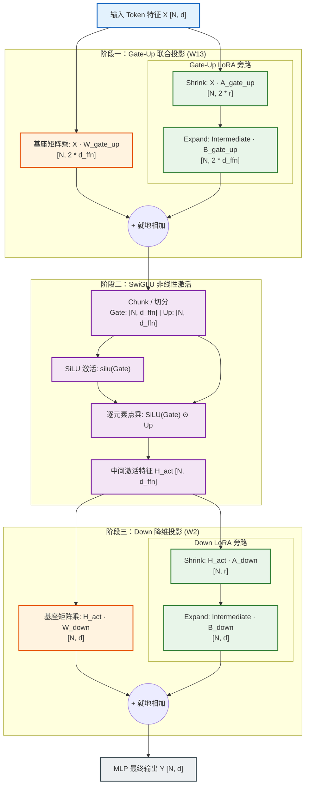
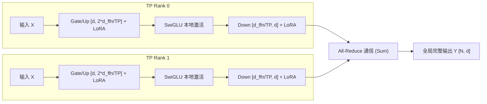
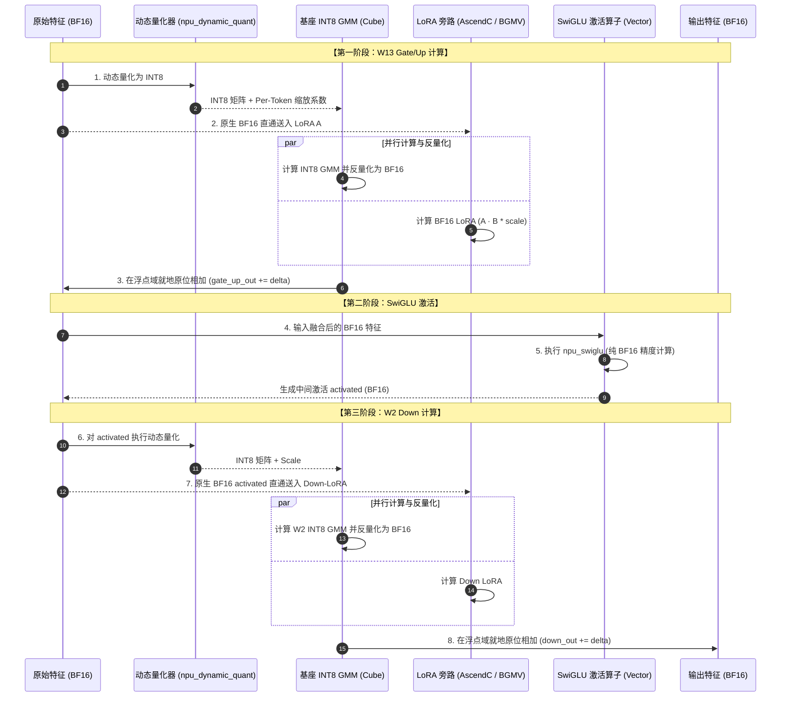

# SwiGLU 架构中的 LoRA 执行路径与数据流全景剖析 (Wiki)

> **定位**：系统性解析现代大语言模型（LLaMA-3/3.1、Qwen-2/2.5/3、DeepSeek-V2/V3/R1 等）中 **SwiGLU 前馈网络（FFN / MLP）与低秩自适应（LoRA）** 深度融合时的端到端执行路径、张量形状变换、算子调度机制及输出流转。  
> **适用技术栈**：vLLM、vLLM-Ascend、PyTorch、AscendC / Triton 算子内核。

---

## 目录
1. [SwiGLU 与 LoRA 的数学本质与拓扑结构](#一-swiglu-与-lora-的技术原理与拓扑结构)
   - 1.1 SwiGLU 激活机制解析
   - 1.2 为什么 SwiGLU 的 LoRA 不能在线性层外后置累加？
   - 1.3 整体计算拓扑图
2. [Dense 密集模型中 SwiGLU-LoRA 执行路径](#二-dense-密集模型中-swiglu-lora-执行路径)
   - 2.1 Gate-Up 阶段：打包投影与 LoRA 融合计算
   - 2.2 激活阶段：非线性门控与切片规约
   - 2.3 Down 阶段：降维投影与 LoRA 累加
   - 2.4 张量并行（TP）下的分片与通信切分
3. [MoE 混合专家模型中 SwiGLU-LoRA 执行路径](#三-moe-混合专家模型中-swiglu-lora-执行路径)
   - 3.1 动态路由与专家 Token 重排（Permute）
   - 3.2 W13 阶段（Gate/Up GMM + moe_lora_apply_w13）
   - 3.3 激活与路由权重缩放（Top-K Scaling）
   - 3.4 W2 阶段（Down GMM + moe_lora_apply_w2）
   - 3.5 逆置换还原与跨卡通信（AllGather / AlltoAll）
4. [量化协同：W8A8 动态量化下的浮点 LoRA 护城河](#四-量化协同w8a8-动态量化下的浮点-lora-护城河)
   - 4.1 精度冲突：为什么不能量化 LoRA 激活？
   - 4.2 推迟量化与交错执行（Interleaved Execution）
   - 4.3 内存生命周期与反量化边界
5. [底层算子执行与权重打包机理](#五-底层算子执行与权重打包机理)
   - 5.1 单 Slot 场景：Triton Split-K 与 Fused Expand
   - 5.2 多 Slot 场景：AscendC BGMV / SGMV 查表与一维索引折叠
   - 5.3 权重内存排布（Packed Layout & Slice Offset）
6. [端到端张量流动清单与输出追踪表](#六-端到端张量流动清单与输出追踪表)
7. [常见异常排查与工程实践陷阱](#七-常见异常排查与工程实践陷阱)

---

## 一、 SwiGLU 与 LoRA 的技术原理与拓扑结构

### 1.1 SwiGLU 激活机制解析

在现代主流大模型中，传统的 Transformer MLP 模块已被 GLU（Gated Linear Unit）变体取代，其中最广泛采用的是 **SwiGLU**（Swish Gated Linear Unit）。

给定输入隐藏状态 $X \in \mathbb{R}^{B \times d}$（其中 $B$ 为批次 Token 数量，$d$ 为隐藏层维度 `hidden_size`），标准 SwiGLU 模块包含三个投影矩阵：
- **门控投影（Gate Proj, $W_{\text{gate}}$）**：$\mathbb{R}^{d \times d_{\text{ffn}}}$
- **上投影（Up Proj, $W_{\text{up}}$）**：$\mathbb{R}^{d \times d_{\text{ffn}}}$
- **下投影（Down Proj, $W_{\text{down}}$）**：$\mathbb{R}^{d_{\text{ffn}} \times d}$

数学表达式为：
$$\text{Gate}(X) = X W_{\text{gate}}$$
$$\text{Up}(X) = X W_{\text{up}}$$
$$\text{SwiGLU}(X) = \text{Swish}_{\beta}(\text{Gate}(X)) \odot \text{Up}(X) = (\text{SiLU}(X W_{\text{gate}})) \odot (X W_{\text{up}})$$
$$\text{Output}(X) = \text{SwiGLU}(X) W_{\text{down}}$$

在工程实现中（如 LLaMA 架构），$W_{\text{gate}}$ 与 $W_{\text{up}}$ 通常在列维度拼接为一个合并矩阵 $W_{\text{gate\_up}} \in \mathbb{R}^{d \times 2d_{\text{ffn}}}$（在 MoE 符号体系中常称为 $W_{13}$）。

---

### 1.2 为什么 SwiGLU 的 LoRA 不能在线性层外后置累加？

对于线性多头注意力（MHA / MQA / GHA）的 Q/K/V 投影，LoRA 可以写为：
$$Y_{\text{qkv}} = X W_{\text{base}} + \frac{\alpha}{r} (X A) B$$
由于矩阵乘法满足分配律，基座输出和 LoRA 增量可以解耦并行计算后简单相加。

**但在 SwiGLU 中存在核心本质差异**：
$\text{SwiGLU}$ 是**非线性门控操作**：
$$\text{SwiGLU}(A + \Delta A, B + \Delta B) \neq \text{SwiGLU}(A, B) + \Delta_{\text{out}}$$
- **非线性屏障**：$\text{SiLU}(x) = x \cdot \sigma(x)$ 具有强非线性，$X(W_{\text{gate}} + \Delta W_{\text{gate}})$ 与 $X(W_{\text{up}} + \Delta W_{\text{up}})$ 必须在逐元素乘法（Hadamard Product $\odot$）**之前**完成相加！
- **Down 投影的级联依赖**：Down 投影的输入不再是原始 Token $X$，而是已经经过 SwiGLU 非线性激活后的中间特征 $H_{\text{act}} \in \mathbb{R}^{B \times d_{\text{ffn}}}$。因此 Down-LoRA 的输入 $A_{\text{down}}$ 必须严格等待 SwiGLU 计算完毕后才能摄入特征。

因此，SwiGLU 结构的 LoRA 执行路径必须被强行拆解为**两阶段交错执行**：
1. **阶段一（Gate/Up 线性区）**：计算基座 Gate/Up 矩阵乘，计算 Gate/Up 的 LoRA 增量，在进入激活函数前就地融合累加。
2. **激活区**：执行非线性 $\text{SiLU}(\text{Gate}) \odot \text{Up}$。
3. **阶段二（Down 线性区）**：将激活后的特征作为输入，分别计算基座 Down 矩阵乘与 Down-LoRA 增量，最后相加输出。

---

### 1.3 整体计算拓扑图



---

## 二、 Dense 密集模型中 SwiGLU-LoRA 执行路径

在 Dense 模型中，LLM 推理框架（如 vLLM / vLLM-Ascend）通常将 MLP 包装为两个主要的并行线性层：
- `MergedColumnParallelLinearWithLoRA`（负责 Gate 和 Up）
- `RowParallelLinearWithLoRA`（负责 Down）

### 2.1 Gate-Up 阶段：打包投影与 LoRA 融合计算

#### 2.1.1 算子与类绑定
在 `vllm-ascend` 中，对应的层为 `AscendMergedColumnParallelLinearWithLoRA`。该类继承自 `_PackedLoRAAWeightsMixin`：
- **基座权重**：`weight` $\in \mathbb{R}^{d \times (2d_{\text{ffn}} / \text{TP})}$。
- **LoRA 权重布局**：
  LoRA A 与 LoRA B 包含两个切片（`slice_0 = gate`，`slice_1 = up`）：
  - `lora_a_stacked`: 包含两个张量，形状均为 `[max_loras, 1, r, d]`。
  - `lora_b_stacked`: 包含两个张量，形状均为 `[max_loras, 1, d_{\text{ffn}} / \text{TP}, r]`。

#### 2.1.2 权重内存打包优化（Packed Weights）
为了消除多次 Kernel 启动开销，`vllm-ascend` 在 `set_lora` 时将 Gate 与 Up 的 LoRA 权重预先拼接为块对角/连续张量：
```python
# vllm_ascend/lora/utils.py
self.lora_a_packed = torch.zeros(
    max_loras, 1, 2 * rank, self.input_size, dtype=lora_config.lora_dtype, device=self.device
)
self.lora_b_packed = torch.zeros(
    max_loras, 1, 2 * rank, sum(self.output_slices), dtype=lora_config.lora_dtype, device=self.device
)
```
- `lora_a_packed`: 将 Gate 和 Up 的 A 矩阵沿 rank 维度拼合为 `[2*r, d]`。
- `lora_b_packed`: 采用对角块（Block Diagonal）布局：
  $$\begin{bmatrix} B_{\text{gate}} & 0 \\ 0 & B_{\text{up}} \end{bmatrix} \in \mathbb{R}^{2r \times 2d_{\text{ffn}}}$$

#### 2.1.3 执行数学流
当单 Slot LoRA（`max_loras == 1`）执行时：
1. **基座前向**：
   $$\text{Output}_{\text{base}} = X \cdot W_{\text{gate\_up}}$$
   输出形状：`[N, 2 * (d_ffn / TP)]`。
2. **LoRA 前向（一次矩阵乘完成 Shrink，一次矩阵乘完成 Expand）**：
   $$\text{Shrink} = X \cdot A_{\text{packed}}^T \quad \to [N, 2r]$$
   $$\Delta_{\text{gate\_up}} = \text{Shrink} \cdot B_{\text{packed}} \quad \to [N, 2 \cdot (d_{\text{ffn}} / \text{TP})]$$
3. **原位融合**：
   $$\text{Output}_{\text{gate\_up}} = \text{Output}_{\text{base}} + \Delta_{\text{gate\_up}}$$

---

### 2.2 激活阶段：非线性门控与切片规约

在 Gate-Up 输出完成后，进入激活函数。
在 Ascend 平台上，调用硬件优化指令 `torch_npu.npu_swiglu` 或 `silu_and_mul`：

```python
# 逻辑等价于：
gate, up = output_gate_up.chunk(2, dim=-1)
# 若存在 swiglu_limit (如部分架构防止溢出的截断):
# gate = gate.clamp(max=limit); up = up.clamp(min=-limit, max=limit)
h_act = torch.nn.functional.silu(gate) * up
```

- **输入张量形状**：`[N, 2 * (d_ffn / TP)]`
- **输出张量形状**：`[N, d_ffn / TP]`
- **算子特性**：
  `npu_swiglu` 是片上融合算子（Fused Vector Op），在 NPU Vector 单元中直接读取连续的门控和上投影特征，在本地缓存完成 SiLU 与点乘并输出，无需将中间切片写回全局显存（HBM）。

---

### 2.3 Down 阶段：降维投影与 LoRA 累加

#### 2.3.1 输入流转
Down 投影层为 `AscendRowParallelLinearWithLoRA`：
- **输入特征**：$H_{\text{act}} \in \mathbb{R}^{N \times (d_{\text{ffn}} / \text{TP})}$
- **基座计算**：
  $$\text{Down}_{\text{base}} = H_{\text{act}} \cdot W_{\text{down}} \quad \to [N, d]$$
  （注：此处为单卡局部 GEMM 结果，尚未 All-Reduce）。

#### 2.3.2 LoRA 计算
- $A_{\text{down}} \in \mathbb{R}^{r \times (d_{\text{ffn}} / \text{TP})}$
- $B_{\text{down}} \in \mathbb{R}^{d \times r}$
- **执行**：
  $$\text{Shrink}_{\text{down}} = H_{\text{act}} \cdot A_{\text{down}}^T \quad \to [N, r]$$
  $$\Delta_{\text{down}} = \text{Shrink}_{\text{down}} \cdot B_{\text{down}}^T \times \text{scale} \quad \to [N, d]$$
  $$\text{Down}_{\text{local}} = \text{Down}_{\text{base}} + \Delta_{\text{down}}$$

---

### 2.4 张量并行（TP）下的分片与通信切分

在多卡张量并行（Tensor Parallelism）下，SwiGLU 的切分遵循 Megatron-LM 规范，LoRA 权重与基座权重保持完全一致的几何切分：

| 模块组件 | 切分类型 | 单卡权重分片形状 | LoRA A 分片 | LoRA B 分片 | 通信操作 |
| :--- | :--- | :--- | :--- | :--- | :--- |
| **Gate/Up Proj** | 列并行 (ColumnParallel) | `[d, 2 * (d_ffn / TP)]` | `[2 * r, d]` (不切分) | `[2 * r, 2 * (d_ffn / TP)]` (列切分) | **无通信** (输入广播，局部输出) |
| **SwiGLU Act** | 逐元素运算 (Elementwise) | 无参数 | - | - | **无通信** (纯片上局部计算) |
| **Down Proj** | 行并行 (RowParallel) | `[d_ffn / TP, d]` | `[r, d_ffn / TP]` (行切分) | `[d, r]` (不切分) | **All-Reduce** (跨 TP 聚合累加) |



> [!IMPORTANT]
> **TP 通信黄金法则**：在整个 SwiGLU-LoRA 复合结构中，**全流程仅有一次通信**（位于 Down 投影之后的 All-Reduce）。Gate/Up 算完后、SwiGLU 激活前后**绝不发生任何跨卡同步**！

---

## 三、 MoE 混合专家模型中 SwiGLU-LoRA 执行路径

在 MoE 模型（如 DeepSeek-V3、Qwen-MoE）中，每个专家（Expert）本质上都是一个完整的 SwiGLU MLP。但由于路由分发机制的存在，输入数据流发生了剧烈重组。

### 3.1 动态路由与专家 Token 重排（Permute）

1. **路由打分**：
   $$P = \text{Softmax}(\text{TopK}(X \cdot W_{\text{gate}}, k))$$
   生成 `topk_ids`（每个 Token 分配的专家编号）与 `topk_weights`。
2. **内存连续化重排（Token Permutation）**：
   由于底层高性能分组矩阵乘（GMM）要求属于同一专家的 Token 必须在内存中严格物理连续，系统调用 `npu_moe_init_routing` 将 Token 重新排序：
   - 原始 Token 序列：$[T_0, T_1, T_2, T_3, \dots]$
   - 排序后 Token 序列：$[\underbrace{T_1, T_3}_{\text{Expert 0}}, \underbrace{T_0}_{\text{Expert 1}}, \dots]$
   - 输出排序后的张量 `hidden_states_sorted` 与行映射 `expanded_row_idx`。

---

### 3.2 W13 阶段（Gate/Up GMM + moe_lora_apply_w13）

代码对应 [`vllm_ascend/ops/fused_moe/routed_experts.py`](file:///Users/zhangfan/project/lora/vllm-ascend/vllm_ascend/ops/fused_moe/routed_experts.py#L220-L275)：

```python
# 1. 基座 W13 分组矩阵乘 (Grouped Matmul, GMM)
gate_up_out = torch_npu.npu_grouped_matmul(
    x=[hidden_states_sorted],
    weight=w13_weight,
    split_item=2, # 同时产出门控和上投影
    group_list=mlp_compute_input.group_list,
    group_type=0,
)[0]

# 2. 注入 W13 LoRA 增量
moe_lora_apply_w13(
    lora_context,
    gate_up_out=gate_up_out,
    hidden_states=hidden_states_sorted,
    lora_routing=self._lora_routing,
)
```

#### 内部细节：`moe_lora_apply_w13` 的一维折叠计算
在 `vllm_ascend/lora/fused_moe.py` 中：
```python
def moe_lora_apply_w13(lora_context, *, gate_up_out, hidden_states, lora_routing):
    expert_per_row, lora_per_row = lora_routing
    if expert_per_row.numel() == 0:
        return
    lora_context.punica_wrapper.add_lora_fused_moe(
        y=gate_up_out,
        x=hidden_states,
        lora_a_stacked=lora_context.w13_lora_a_stacked,
        lora_b_stacked=lora_context.w13_lora_b_stacked,
        expert_ids=expert_per_row,
        adapter_enabled=lora_context.adapter_enabled,
        token_lora_mapping=lora_per_row,
    )
```
- **关键机制**：每一行利用 `combined_idx = lora_id * num_experts + expert_id` 直寻底层预分配的大显存池。
- **输出状态**：`gate_up_out` 在原位累加了对应专家的 LoRA 增量，其数值格式依然是纯浮点（BF16/FP16）。

---

### 3.3 激活与路由权重缩放（Top-K Scaling）

在 Gate-Up 结果就绪后，执行专家的 SwiGLU 激活：
```python
# vllm_ascend/lora/quant_moe.py & routed_experts.py
activated = _apply_moe_activation(
    gate_up_out,
    mlp_compute_input.activation, # MoEActivation.SWIGLU
    mlp_compute_input.swiglu_limit,
    mlp_compute_input.swiglu_alpha,
    mlp_compute_input.swiglu_beta,
)

# 乘上路由器打分权重 (如果配置推迟在激活后相乘)
if mlp_compute_input.topk_scales is not None:
    activated *= mlp_compute_input.topk_scales
```
- **输入**：`gate_up_out` $\in \mathbb{R}^{[M, 2 \cdot d_{\text{expert\_intermediate}}]}$
- **输出**：`activated` $\in \mathbb{R}^{[M, d_{\text{expert\_intermediate}}]}$

---

### 3.4 W2 阶段（Down GMM + moe_lora_apply_w2）

激活后的输出作为特征，流入 W2（Down 降维）：
```python
# 1. 基座 W2 GMM 降维
down_out = torch_npu.npu_grouped_matmul(
    x=[activated],
    weight=w2_weight,
    group_list=mlp_compute_input.group_list,
    group_type=0,
)[0]

# 2. 注入 W2 LoRA 增量
moe_lora_apply_w2(
    lora_context,
    down_out=down_out,
    silu_out=activated, # 核心：将激活特征送入 LoRA A
    lora_routing=self._lora_routing,
)
```

> [!NOTE]
> **精度细节**：注意传给 `moe_lora_apply_w2` 的 `silu_out` 是**未被量化**的高精度浮点激活结果。

---

### 3.5 逆置换还原与跨卡通信（AllGather / AlltoAll）

最后，计算完毕的专家输出需要按原始输入次序复原：
- **单卡 / AllGather TP**：
  调用 `npu_moe_finalize_routing` 或反向索引映射：
  $$Y_{\text{final}}[\text{orig\_idx}] = \sum_{k} \text{down\_out}[j] \times \text{topk\_weight}_{k}$$
- **AlltoAll EP**：
  跨卡通过 `async_all_to_all` 网络交换反向归还给发起卡，最终在各个发起卡上完成还原聚拢。

---

## 四、 量化协同：W8A8 动态量化下的浮点 LoRA 护城河

在 W8A8 量化模式下，基座大模型（粗壮主干）被压缩为 INT8 以榨干 NPU 的 INT8 Cube 计算性能；然而 LoRA 增量（微雕旁路）信号微弱，必须在 BF16/FP16 下计算。

### 4.1 精度冲突：为什么不能量化 LoRA 激活？

如果将量化后的 INT8 激活送给 LoRA：
$$\text{LoRA\_Delta} \approx (\text{Quant}_{\text{int8}}(X) \cdot A) \cdot B$$
由于 INT8 仅能表达 256 个离散量化档位，微调阶段学到的细粒度梯度分布将被量化噪声彻底吞噬，模型推理直接劣化出现死循环或乱码。

### 4.2 推迟量化与交错执行（Interleaved Execution）

在 [`vllm_ascend/lora/quant_moe.py`](file:///Users/zhangfan/project/lora/vllm-ascend/vllm_ascend/lora/quant_moe.py#L204-L281) 中，确立了教科书级的**推迟量化与双路交错范式**：



#### 关键步骤代码解析：
1. **W13 矩阵乘**：
   ```python
   # 仅对送入基座矩阵的特征量化
   quantized_input, input_scale = DeviceOperator.npu_dynamic_quant(hidden_states=hidden_states, ...)
   # 基座 INT8 GMM 运行，直接输出 BF16 反量化张量
   gate_up_out = torch_npu.npu_grouped_matmul(x=[quantized_input], weight=w1, ..., output_dtype=torch.bfloat16)[0]
   # LoRA 旁路消费未经量化的原生 hidden_states
   moe_lora_apply_w13(lora_context, gate_up_out=gate_up_out, hidden_states=hidden_states, ...)
   ```
2. **SwiGLU 激活**：
   ```python
   # 在全精度 BF16 下执行 SwiGLU
   activated = _apply_moe_activation(gate_up_out, ...)
   ```
3. **W2 降维**：
   ```python
   # 再次对激活输出动态量化送入基座
   quantized_activated, activated_scale = DeviceOperator.npu_dynamic_quant(hidden_states=activated, ...)
   down_out = DeviceOperator.npu_grouped_matmul_gmm2(hidden_states=quantized_activated, weight=w2, ...)
   # LoRA 旁路消费未经二次量化的 activated
   moe_lora_apply_w2(lora_context, down_out=down_out, silu_out=activated, ...)
   ```

---

## 五、 底层算子执行与权重打包机理

### 5.1 单 Slot 场景：Triton Split-K 与 Fused Expand

在单 Adapter 服务场景（`max_loras == 1`），Ascend A2/A3 芯片引入了端到端 Triton 高性能核函数（PR #15884）：
1. **Split-K Shrink 算子**：
   对于输入矩阵 $X \in \mathbb{R}^{N \times d}$ 与 $A \in \mathbb{R}^{r \times d}$，由于 $r$ 通常很小（如 8、16、64），直接矩阵乘会导致 NPU 内部大量计算单元闲置。
   Split-K 算子将隐藏维度 $d$ 切分为多份，分配到不同的核（AI Core）上并行点积，最后在 片上 Workspace 中归约，极大地释放了 NPU 算力。
2. **Sliced Expand 融合算子**：
   在 Expand 阶段，中间张量与 $B_{\text{packed}}$ 进行矩阵乘，并配合 `_single_lora_mask` 掩码就地加回基座输出。

---

### 5.2 多 Slot 场景：AscendC BGMV / SGMV 查表与一维索引折叠

在多租户 Multi-LoRA 场景下，Batch 中包含多个不同的 LoRA 任务，系统下沉至由 C++ / AscendC 编写的高性能核函数：
- **`bgmv_shrink`**：
  $$\text{shrink\_out}[i] = X[i] \cdot A_{\text{stacked}}[\text{indices}[i]] \times \text{scale}$$
- **`bgmv_expand` / `bgmv_expand_slice`**：
  $$Y[i, \text{offset}:\text{offset}+\text{slice}] += \text{shrink\_out}[i] \cdot B_{\text{stacked}}[\text{indices}[i]]$$

#### -1 Sentinel 哨兵机制
当某个 Token 属于基座模型（Base Request，未装配 LoRA）时，`indices[i] = -1`。
底层的 AscendC Kernel 在循环解码时：
```cpp
if (lora_idx < 0) {
    // 遇到 -1 哨兵，硬件指令直接跳过该行的数据搬运与计算，输出保持原样
    continue;
}
```
该特性彻底消除了 CPU/Host 侧通过布尔掩码截取非零 Token 引起的动态张量尺寸抖动。

---

### 5.3 权重内存排布（Packed Layout & Slice Offset）

对于 SwiGLU 的 Gate 和 Up 两个切片，在底层的内存排列关系如下：

```
+-------------------------------------------------------------------------------+
|                            lora_a_packed [2*r, d]                             |
+---------------------------------------+---------------------------------------+
|          Gate LoRA A [0..r-1, d]      |        Up LoRA A [r..2r-1, d]         |
+---------------------------------------+---------------------------------------+

+-------------------------------------------------------------------------------+
|                      lora_b_packed [2*r, 2 * d_ffn / TP]                      |
+---------------------------------------+---------------------------------------+
|    Gate LoRA B [0..r-1, d_ffn/TP]     |                 0                     |
+---------------------------------------+---------------------------------------+
|                 0                     |      Up LoRA B [r..2r-1, d_ffn/TP]    |
+---------------------------------------+---------------------------------------+
```

通过这种块对角布局（Block Diagonal），仅需一次 `bgmv_shrink` 和一次 `bgmv_expand_slice`，即可并行算出 Gate 和 Up 两部分的增量，不仅减少了 50% 的算子下发（Launch Overhead），更为 SwiGLU 的前置合并打下了坚实基础。

---

## 六、 端到端张量流动清单与输出追踪表

以下追踪一个携带 LoRA 的 Token 在通过一个完整 SwiGLU MLP 模块时的张量流转全程：

| 序号 | 执行阶段 | 算子 / 逻辑 | 输入张量及形状 | 权重张量及形状 | 输出张量及形状 | 数值类型 (Dtype) | 内存操作特性 |
| :--- | :--- | :--- | :--- | :--- | :--- | :--- | :--- |
| **1** | **输入准备** | LayerNorm / RMSNorm | `X`: `[N, d]` | `norm_weight`: `[d]` | `X_norm`: `[N, d]` | BF16 | 新建临时张量 |
| **2** | **Gate/Up 基座** | Matmul / ColumnParallel | `X_norm`: `[N, d]` | `W_gate_up`: `[d, 2*d_ffn]` | `Y_base_13`: `[N, 2*d_ffn]` | BF16 (INT8 if quant) | 主通路输出 |
| **3** | **Gate/Up LoRA A** | `bgmv_shrink` | `X_norm`: `[N, d]` | `A_13`: `[2*r, d]` | `shrink_13`: `[N, 2*r]` | FP32 / BF16 | 写入预分配 Buffer |
| **4** | **Gate/Up LoRA B** | `bgmv_expand` | `shrink_13`: `[N, 2*r]` | `B_13`: `[2*r, 2*d_ffn]` | `delta_13`: `[N, 2*d_ffn]` | BF16 | **In-place 累加到 Y_base_13** |
| **5** | **SwiGLU 激活** | `npu_swiglu` | `Y_base_13`: `[N, 2*d_ffn]` | 无 | `H_act`: `[N, d_ffn]` | BF16 | Vector 片上计算规约 |
| **6** | **Down 基座** | Matmul / RowParallel | `H_act`: `[N, d_ffn]` | `W_down`: `[d_ffn, d]` | `Y_base_down`: `[N, d]` | BF16 (INT8 if quant) | 主通路输出 |
| **7** | **Down LoRA A** | `bgmv_shrink` | `H_act`: `[N, d_ffn]` | `A_down`: `[r, d_ffn]` | `shrink_down`: `[N, r]` | FP32 / BF16 | 写入预分配 Buffer |
| **8** | **Down LoRA B** | `bgmv_expand` | `shrink_down`: `[N, r]` | `B_down`: `[r, d]` | `delta_down`: `[N, d]` | BF16 | **In-place 累加到 Y_base_down** |
| **9** | **分布式聚合** | `all_reduce` (TP > 1) | `Y_base_down`: `[N, d]` | 无 | `Y_reduced`: `[N, d]` | BF16 | 跨卡通信原位归约 |
| **10** | **残差连接** | `Add` | `X`: `[N, d]`, `Y_reduced` | 无 | `Final_Out`: `[N, d]` | BF16 | 残差累加 |

---

## 七、 常见异常排查与工程实践陷阱

### 7.1 切片交织次序颠倒（Interleaved vs Non-Interleaved）
- **现象**：加载带有 LoRA 的模型后，注意力层正常，但只要经过 MLP 层，模型输出立即出现严重困惑度爆炸（PPL > 1000）。
- **根因**：
  不同的基座模型和 LoRA 权重转换脚本在 Gate 与 Up 拼接时的顺序不统一。
  - HuggingFace LLaMA 权重：$[W_{\text{gate}}, W_{\text{up}}]$（连续拼接）。
  - 部分量化或老式导出脚本：$[W_{\text{gate}}[0], W_{\text{up}}[0], W_{\text{gate}}[1], \dots]$（交错存储）。
- **排查与修正**：
  检查模型配置中的 `swigluoai_uninterleave` 标记。在 vLLM-Ascend 中，若存在交错，需调用专用解交错算子 `torch_npu.npu_clipped_swiglu(..., interleaved=False)`。

### 7.2 误将量化后张量传入 LoRA 旁路
- **现象**：开启 W8A8 量化 MoE 后，基座模型输出正常，但挂载 LoRA 后模型胡言乱语。
- **根因**：
  开发时直接将 `quantized_input`（INT8 张量）复用给了 `moe_lora_apply_w13`。由于数据类型截断和 scale 丢失，LoRA 计算出的 `shrink` 完全是噪声。
- **排查与修正**：
  检查 `vllm_ascend/lora/quant_moe.py`，必须显式传递未量化的 `hidden_states` 给 `moe_lora_apply_w13`，传递未量化的 `silu_out` 给 `moe_lora_apply_w2`。

### 7.3 ACLGraph 静态图模式下由于动态掩码导致的死锁或崩溃
- **现象**：在开启图模式时报错 `aclnnUnique2` 异常或图录制失败。
- **根因**：
  在计算 Gate/Up 的 LoRA 时使用了类似于 `x[mask]` 的 Python 动态布尔索引切片，导致输出张量形状依赖于当前 batch 中活跃的 LoRA Token 数量。
- **排查与修正**：
  全面改用基于 `combined_idx` 的一维折叠张量方案。保证输入输出维度始终为静态的固定张量大小，无 LoRA 的位置由核函数内部根据 `-1` 哨兵跳过。

---

## 八、 总结与最佳实践准则

在 SwiGLU 架构中实现高性能、高精度的 LoRA 执行路径，需严格遵循以下三大设计铁律：
1. **边界铁律**：非线性 SwiGLU 激活是不可逾越的代数边界，LoRA 注入必须被切分为“进入 SwiGLU 之前”与“离开 SwiGLU 之后”两段独立流水线。
2. **精度铁律**：无论基座模型采用 INT8、FP8 还是 INT4 量化，LoRA 旁路的分支起点必须截取原生高精度浮点（BF16/FP16）输入，并在浮点域与基座反量化输出完成就地累加。
3. **图化铁律**：多租户 Multi-LoRA 调度严禁产生数据依赖的动态尺寸，必须依托权重打包（Packed Weights）与一维索引折叠（Index Folding），确保显存排布与算子静态可捕获。
