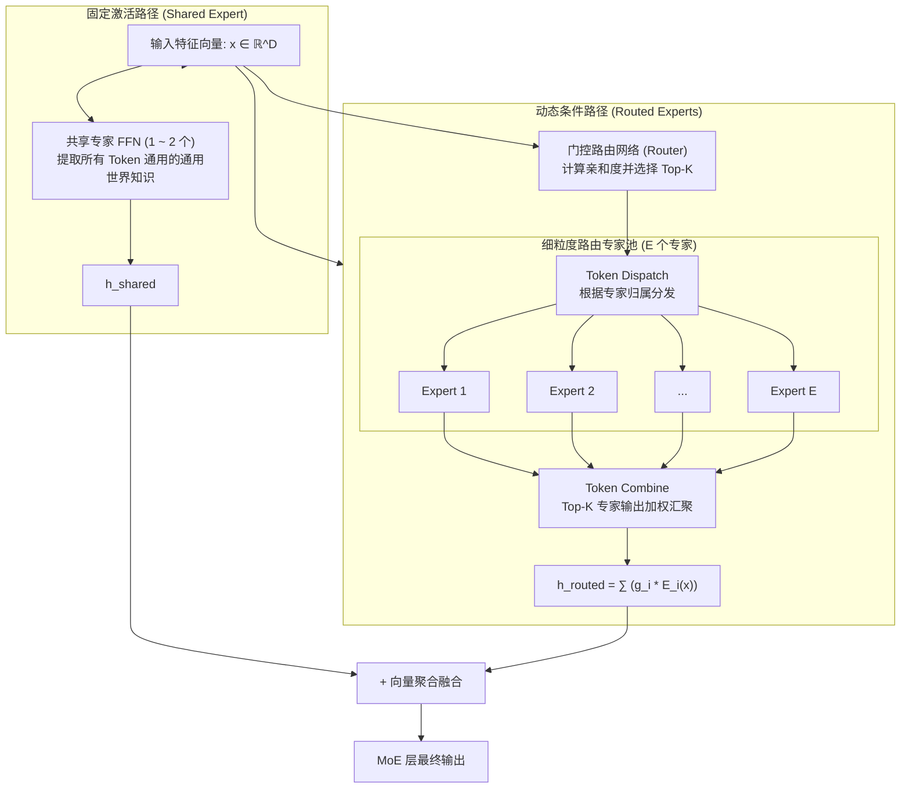

# 大模型架构演进与分布式系统：从经典 Transformer 到现代 MoE 与通信分发机制全景指南

---

## 目录
1. [一、 经典 Transformer 架构：全连接密集的基石](#一-经典-transformer-架构全连接密集的基石)
   - 1.1 经典结构全景与数据流
   - 1.2 核心子层剖析：自注意力与全连接（FFN）
   - 1.3 残差连接与前置归一化的深层价值
   - 1.4 密集（Dense）模型的算力与显存瓶颈
2. [二、 现代 MoE 架构演进：解耦参数容量与算力开销](#二-现代-moe-架构演进解耦参数容量与算力开销)
   - 2.1 经典 MoE 到前沿 MoE 的设计演变
   - 2.2 现代 MoE 核心组件拆解（以 DeepSeek-V3 / Qwen2-MoE 为范式）
   - 2.3 共享专家（Shared Experts）与细粒度路由专家（Routed Experts）
   - 2.4 路由机制与无辅助损失（Aux-Loss-Free）负载均衡
3. [三、 分布式 MoE 的生命周期：通信分发、专家计算与聚合全流程](#三-分布式-moe-的生命周期通信分发专家计算与聚合全流程)
   - 3.1 预备知识：角色认知（源 GPU vs. 专家 GPU）与上下文解耦
   - 3.2 阶段一：Token Dispatch（通信分发）
   - 3.3 阶段二：apply_moe_mlp（核心算力阶段）
   - 3.4 阶段三：Token Combine（通信聚合与残差闭环）
4. [四、 并行范式对比：专家并行（EP） vs. 张量并行（TP）](#四-并行范式对比专家并行ep-vs-张量并行tp)
   - 4.1 核心差异多维对比
   - 4.2 为什么 EP 适合跨机集群，而 TP 局限于单机 NVLink？
5. [五、 工业级工程挑战与前沿优化技术](#五-工业级工程挑战与前沿优化技术)
   - 5.1 通信-计算重叠（Communication-Computation Overlap / DualPipe）
   - 5.2 低精度通信与显存压缩

---

## 一、 经典 Transformer 架构：全连接密集的基石

### 1.1 经典结构全景与数据流

经典 Transformer 架构（自 *Attention Is All You Need (2017)* 提出）是现代生成式大语言模型（LLM）的母体。当前主流自回归 LLM 均采用 **Decoder-Only** 变体。

```
输入文本 Token 序列: x ∈ ℝ^(Batch × Seq_Len)
           │
           ▼
┌──────────────────────────────────────────────┐
│ Token Embedding + 位置编码 (RoPE / ALiBi)     │
└──────────────────────┬───────────────────────┘
                       │
         ┌─────────────┴─────────────┐  (重复 N 层)
         │  Transformer Block 骨干    │
         │                           │
         │  Input x                  │
         │    │                      │
         │    ▼                      │
         │  RMSNorm                  │
         │    ▼                      │
         │  Multi-Head Attention (MHA)│
         │    │                      │
         │    ▼                      │
         │  + 残差相加 1  ◄──────────┤ (x + MHA(Norm(x)))
         │    │                      │
         │    ▼                      │
         │  RMSNorm                  │
         │    ▼                      │
         │  Dense MLP / FFN 模块      │
         │    │                      │
         │    ▼                      │
         │  + 残差相加 2  ◄──────────┤ (h + FFN(Norm(h)))
         │    │                      │
         └────┼──────────────────────┘
              │
              ▼
┌──────────────────────────────────────────────┐
│ Final RMSNorm                                │
└──────────────────────┬───────────────────────┘
                       ▼
┌──────────────────────────────────────────────┐
│ LM Head 线性分类层: ℝ^D ➔ ℝ^Vocab_Size       │
└──────────────────────────────────────────────┘
```

### 1.2 核心子层剖析

一个标准 Transformer 块由两大核心计算模块串联而成：

1. **多头自注意力机制（Multi-Head Attention, MHA）**：
   - **使命**：实现 **Token 之间的横向交互与上下文特征汇聚**。
   - **公式**：
     $$\text{Attention}(Q, K, V) = \text{Softmax}\left(\frac{Q K^T}{\sqrt{d_k}} + M\right) V$$
   - 在生成式自回归模型中，必须加入因果掩码 $M$（Causal Mask / 下三角掩码），确保当前位置的 Token 仅能看见它之前的 Token，维持严格的时序因果逻辑。
2. **前馈全连接网络（Dense MLP / FFN）**：
   - **使命**：对单个 Token 向量进行 **纵向的高维特征映射与非线性记忆存储**。
   - **现代标准变体（SwiGLU）**：
     $$\text{FFN}(x) = (\text{Swish}(x W_{\text{gate}}) \odot x W_{\text{up}}) W_{\text{down}}$$
   - **关键特性（Point-wise / Token 独立性）**：
     FFN 的计算是纯粹逐 Token（Token-wise）进行的——即 Token $i$ 在经过 FFN 时，完全不依赖、不读取 Token $j$ 的任何信息。

### 1.3 残差连接与前置归一化的深层价值

每一层子结构周围都挂载着**残差连接（Residual Connection）**：
$$x_{l+1} = x_l + \text{SubLayer}(\text{RMSNorm}(x_l))$$
* **数值稳定性**：使梯度在反向传播时能通过“恒等映射通道（Highway）”无衰减地直接冲回浅层，彻底攻克了深层神经网络梯度消失/爆炸难题。
* **物理意义**：主干路径上的向量 $x_l$ 代表着该 Token 的原始信息与历层累加特征；每个子层（Attention 或 FFN）仅仅负责向其提供“特征增量”。

### 1.4 密集（Dense）模型的算力与显存瓶颈

在 Dense 模型中，**每个 Token 必须激活模型 100% 的参数**：
* 随着模型规模从 7B 扩充到 70B乃至万亿，模型的每个 Token 前向传播所需的算力（FLOPs）呈线性激增。
* **两难困境**：想要更高的知识容量，必须增大参数量；增大参数量，单步推理和训练的算力消耗就会突破物理承受极限。这一物理瓶颈直接催生了 **MoE（Mixture of Experts）** 架构的诞生。

---

## 二、 现代 MoE 架构演进：解耦参数容量与算力开销

### 2.1 经典 MoE 到前沿 MoE 的设计演变

MoE 的核心思想是**条件计算（Conditional Computation）**：构建海量参数，但对每个输入的 Token，只选择性地激活一小部分网络。

| 发展阶段 | 代表模型 | 专家粒度与激活方式 | 路由与结构特征 |
| :--- | :--- | :--- | :--- |
| **早期 MoE** | Switch Transformer, GShard | 粗粒度（Top-1 或 Top-2） | 缺乏通用保障，容易产生模型不收敛与路由退化 |
| **过渡期 MoE** | Mixtral 8x7B | 8 个大专家中选 Top-2 | 所有专家平等参与路由，缺乏共享常识载体 |
| **现代细粒度 MoE** | **DeepSeek-V2/V3, Qwen2-MoE** | **极细粒度**（如 256 专家激活 8 个） | **共享专家 + 细粒度路由专家 + 无辅损负载均衡** |

### 2.2 现代 MoE 核心组件拆解

在当前先进的 Transformer 架构中，原有的 Dense FFN 层被整体替换为 **MoE 复合结构**：



### 2.3 共享专家（Shared Experts）与细粒度路由专家

现代 MoE（以 DeepSeek-V3 为典型代表）在架构上做出了两大划时代变革：

1. **显式设立共享专家（Dedicated Shared Experts）**：
   - **动机**：任何自然语言 Token（无论代码、数学还是文学）都共享海量的通用语义语法常识。如果完全由路由专家分担，会导致所有专家被迫各自存储一套冗余的底层常识，侵占模型有效容量。
   - **机制**：1~2 个独立的专家**始终保持激活**，所有 Token 100% 无条件流经它们。
2. **细粒度切分（Fine-Grained Experts）**：
   - 将传统的单个大专家（如 FFN 隐层维度为 $4D$）切分为若干个微型专家（如维度为 $D/2$ 或 $D/4$）。
   - **收益**：专家总数扩展至 64、128 甚至 256 个，每次动态挑选 Top-8。专家组合的可能空间从 $C_8^2 = 28$ 种指数级跃升至 $C_{256}^8 \approx 4.3 \times 10^{14}$ 种，极大增强了模型细粒度专门化表征能力。

### 2.4 路由机制与无辅助损失（Aux-Loss-Free）负载均衡

* **门控路由计算**：
  给定 Token 向量 $x$，Router 通过线性层计算其与各专家的亲和度 logits：
  $$s_i = x \cdot W_{r, i} + b_i$$
  通过 Softmax 归一化后截取前 $K$ 个最大值及其权重系数 $g_i$。
* **无辅助损失负载均衡（Aux-Loss-Free Balancing）**：
  - 传统做法：强行添加辅助损失函数惩罚热门专家，但这会导致梯度与主任务优化目标冲突，损害模型精度。
  - 现代突破：采用**动态偏置（Dynamic Bias Adjustment）**。在推理/训练中监测各专家的实际排队长度；如果某个专家超载，则在线微调其偏置 $b_i$ 降低其吸引力，做到算法无损的天然平滑分流。

---

## 三、 分布式 MoE 的生命周期：通信分发、专家计算与聚合全流程

在工业级集群中，专家被切分在不同的 GPU 上（专家并行 EP）。此时，MoE 层呈现出极其关键的**三阶段流水线**：

$$\text{Token Dispatch (通信分发)} \longrightarrow \text{apply\_moe\_mlp (专家计算)} \longrightarrow \text{Token Combine (通信聚合)}$$

### 3.1 预备知识：角色认知与上下文解耦

* **源 GPU（Source GPU / Token 户籍地）**：
  - 由数据并行（DP）或序列并行（SP）分配持有该批次 Token。
  - 在进入 MoE 之前，源 GPU 已经完成了**该 Token 的因果自注意力计算**。
  - **核心事实**：此时每个 Token 的向量已经吸收了整句话的所有前因后果。
  - **残差守候**：源 GPU 的显存中**保留着进入 MoE 之前的原始张量 $x$**，用于等待后续相加。
* **专家 GPU（Expert GPU / 专科诊室）**：
  - 显存中常驻若干个特定专家的权重矩阵，专职提供矩阵乘法算力。

```
[源 GPU 0] (持有 Token 1, 2)                     [源 GPU 1] (持有 Token 3, 4)
    │                                                │
    ├── Token 1 命中 Expert A (位于 GPU 0)             ├── Token 3 命中 Expert A (位于 GPU 0)
    └── Token 2 命中 Expert B (位于 GPU 1)             └── Token 4 命中 Expert B (位于 GPU 1)
    │                                                │
════╪════════════════════════════════════════════════╪══════════════════════════════════════════
    ▼  【阶段一: Token Dispatch (All-to-All 集合通信)】
════╪════════════════════════════════════════════════╪══════════════════════════════════════════
    │                                                │
    ▼                                                ▼
[专家 GPU 0] (负责 Expert A)                     [专家 GPU 1] (负责 Expert B)
  收到: Token 1 + Token 3                          收到: Token 2 + Token 4
    │                                                │
    ▼                                                ▼
  【阶段二: apply_moe_mlp (Grouped GEMM 纯算力)】   【阶段二: apply_moe_mlp (Grouped GEMM 纯算力)】
    │                                                │
════╪════════════════════════════════════════════════╪══════════════════════════════════════════
    ▼  【阶段三: Token Combine (All-to-All 反向集合通信)】
════╪════════════════════════════════════════════════╪══════════════════════════════════════════
    │                                                │
    ▼                                                ▼
[源 GPU 0]                                       [源 GPU 1]
  - 收到 Token 1, 2 的专家特征增量                   - 收到 Token 3, 4 的专家特征增量
  - 按 Gate 权重加权求和                             - 按 Gate 权重加权求和
  - 恢复序列顺序 (Unpermute)                         - 恢复序列顺序 (Unpermute)
  - 提取留在本地的输入 x 执行残差相加:                - 提取留在本地的输入 x 执行残差相加:
    x_new = x + Combined_MoE(x)                      x_new = x + Combined_MoE(x)
```

---

### 3.2 阶段一：Token Dispatch（通信分发）

1. **本地重排（Permute & Pack）**：
   源 GPU 本地有 $N$ 个 Token。根据门控网络的决策，扫描每个 Token 需要去往哪张远程卡。将目的地址相同的 Token 连续打包进发送缓冲区（Send Buffer）。
2. **跨卡大交换（All-to-All 通信）**：
   调用底层集合通信算子（`ncclAllToAllv`）。
   每个 GPU 同时向其他所有 GPU 发送属于对方专家的 Token 副本，并同时接收来自全网其他卡指派给本地专家的 Token。
3. **数据重组（Unpack & Alignment）**：
   目标卡接收到来自各方的 Token，将其按照本地负责的每个专家编号紧凑对齐，准备就绪。

---

### 3.3 阶段二：apply_moe_mlp（核心算力阶段）

* **为什么是“核心算力阶段”？**
  * **零通信干预**：这是三部曲中唯一的**纯计算密集型（Compute-bound）**阶段。此时跨卡通信处于完全静默状态，GPU 的 Tensor Core 全力运行。
  * **上下文完全解耦**：每个送上门的 Token 都已经是独立的“语义封装体”，无需序列上下文，直接接受非线性变换。
* **工业级计算引擎：Grouped GEMM**：
  * **难题**：每个专家分到的 Token 数量完全是动态不规则的（Expert 1 收到 128 个，Expert 2 收到 12 个）。
  * **方案**：传统的循环调用不仅会导致显存碎片，还会反复触发 CUDA Kernel Launch 开销。现代系统使用 CUTLASS / Triton 开发的 **Grouped GEMM**，把多个维度不同的矩阵乘法（$W_{\text{gate}}, W_{\text{up}}, W_{\text{down}}$）融合进单次底层 Kernel 调度中一次性完成。

---

### 3.4 阶段三：Token Combine（通信聚合与残差闭环）

1. **原路回传（Reverse All-to-All）**：
   专家 GPU 运算完毕后，将输出张量作为 Payload，通过第二次 `All-to-All` 反向集合通信发回各自的**源 GPU**。
2. **门控加权融合（Gate Weighted Sum）**：
   源 GPU 收到一个 Token 被多个专家处理后的多份特征向量，根据在第一步保留的门控权重进行线性加权累加：
   $$h_{\text{routed}} = \sum_{k=1}^K g_k \cdot \text{Expert}_k(x)$$
3. **空间还原（Unpermute / Scatter）**：
   根据分发前记录的原始序列位置索引，将打散的 Token 精确填回原始 Sequence 维度。
4. **残差闭环相加**：
   拿出一直静止保存在源 GPU 本地显存中的原始输入张量 $x$：
   $$x_{\text{next}} = x + h_{\text{routed}} + h_{\text{shared}}$$
   自此，该 MoE 层计算全部闭环，输出顺畅流入下一个 Transformer 块。

---

## 四、 并行范式对比：专家并行（EP） vs. 张量并行（TP）

分布式训练中，EP 与 TP 经常被混淆，因为它们都属于**“层内模型切分”**。但二者有着截然不同的物理逻辑：

```
【张量并行 TP】                                【专家并行 EP】
切分大矩阵本身 (按特征维度切)                     切分专家列表 (每个专家矩阵完整)

     输入同一个 Token                               输入不同的 Token
    ┌───────────────┐                             ┌───────────────┐
    │     Token     │                             │ Token1 Token2 │
    └───────┬───────┘                             └───┬───────┬───┘
       ┌────┴────┐                                    │       │
       ▼         ▼                                    ▼       ▼
    [GPU 0]   [GPU 1]                              [GPU 0] [GPU 1]
    (算半截)   (算半截)                              (算完整) (算完整)
       └────┬────┘                                    │       │
            ▼ All-Reduce                               ▼ All-to-All
      相加拼出完整特征                                结果送回源 GPU 
```

### 4.1 核心差异多维对比

| 评估维度 | 张量并行 (Tensor Parallelism, TP) | 专家并行 (Expert Parallelism, EP) |
| :--- | :--- | :--- |
| **切分对象** | **单个权重矩阵本身**（按行或列将单矩阵切分成小块） | **专家集合**（保留每个专家的完整权重矩阵） |
| **单个 Token 的计算归属** | **所有 GPU 共同计算同一个 Token 的不同通道特征** | **单个 GPU 独占算完指派给它的 Token 的全部通道特征** |
| **集合通信算子** | **All-Reduce**（或 All-Gather + Reduce-Scatter） | **All-to-All**（Token Dispatch & Combine） |
| **通信确定性** | **完全确定、静态**（每次传递的数据包大小绝对固定） | **动态、非确定**（依赖动态路由，容易产生数据偏斜） |
| **网络硬件极限** | **强依赖超低延迟与极限带宽**（必须在单机 8 卡 NVLink 内） | **容忍较高延迟**（可顺畅扩展至数百节点跨机 RDMA/IB） |
| **负载均衡诉求** | **天然均衡**（无负载均衡问题） | **极度依赖负载均衡**（易出现 Straggler 木桶效应） |

### 4.2 为什么 EP 适合跨机集群，而 TP 局限于单机？

* **TP 的致命痛点（高频微小通信）**：
  在单个 Transformer 层中，注意力层和 MLP 层各需要执行一次微秒级的 `All-Reduce` 通信。一旦跨越物理机柜，网络延迟（几微秒 vs 几十微秒）会导致算力利用率（MFU）悬崖式暴跌。因此工业界 TP 规模通常牢牢卡在 **TP=4 或 TP=8**。
* **EP 的跨机扩展力（大块批量通信）**：
  EP 的通信发生在整个 MoE 层的首尾两端，传输的是成批的 Token 数据包。这种大粒度的数据交换与现代跨机高速 RDMA（如 400Gbps / 800Gbps InfiniBand）的拓扑特性天然契合。在 DeepSeek-V3 体系中，**EP 规模高达 64**，跨越数十个机柜无缝协同。

---

## 五、 工业级工程挑战与前沿优化技术

### 5.1 通信-计算重叠（Overlap / DualPipe）

MoE 两次 All-to-All 通信的绝对耗时依然非常昂贵。当前前沿系统（如 DeepSeek DualPipe）的核心设计哲学是：**绝不让 GPU 干等通信结束**。

```
常规无重叠模式:
GPU 算力: ───[ 等待 Dispatch ]───► [ apply_moe_mlp 纯计算 ] ───[ 等待 Combine ]───►
网络通信: ───[ All-to-All 传输 ]────────────────────────────────[ All-to-All 回传 ]───►

双流水线重叠模式 (DualPipe / Overlap):
GPU 算力: ───[ Batch_N-1 的 MLP 计算 ]───► [ Batch_N 的 MLP 计算 ]───►
网络通信: ───[ Batch_N 的 Dispatch 传输 ]─► [ Batch_N-1 的 Combine 回传 ]─►
          ▲                               ▲
          └──────── 两者在时间轴上完全重叠 ────┘
```
通过精巧的微批次（Micro-batch）交错调度，当 GPU 正在算上一组 Token 的 MLP 时，通信引擎已经在网络中并行传输下一组 Token，将昂贵的跨机 All-to-All 通信时间几乎完全“隐藏掩盖”在计算时间之内。

### 5.2 低精度通信与显存压缩

* **FP8 通信**：
  在 Token Dispatch 和 Combine 阶段，将传输的激活值（Activation）动态量化为 **FP8（E4M3 或 E5M2）** 格式，使跨机通信数据量直接削减 **50%**，大幅减轻了网络背板的带宽压力。
* **无死角残差复用**：
  源 GPU 牢牢保留原始残差向量 $x$ 的显存引用，避免在跨卡流动中出现多余的内存拷贝和冗余传递，将分布式 MoE 的系统额外显存开销压缩到最低限度。
