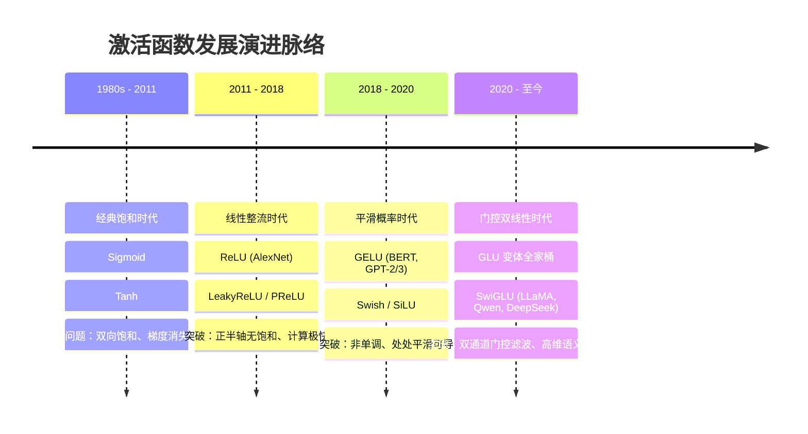

# 大模型激活函数的演进与原理：从 ReLU、GELU 到 SwiGLU

> **Wiki 导读**：激活函数是赋予神经网络“非线性表达能力”的核心组件。从早期多层感知机的饱和函数，到现代自回归大语言模型（LLM）的门控单元，激活函数经历了一场从“硬截断”到“概率平滑”，再到“双通道门控滤波”的技术革命。本文系统梳理大模型激活函数的发展脉络、数学原理及工业界主流选型。

---

## 目录
1. [激活函数的演进编年史](#一-激活函数的演进编年史)
2. [经典时代的探索：从 Sigmoid 到 ReLU](#二-经典时代的探索从-sigmoid-到-relu)
3. [预训练时代的标准：GELU 的平滑与概率门控](#三-预训练时代的标准gelu-的平滑与概率门控)
4. [现代大模型的绝对统治者：Swish / SiLU 与 SwiGLU](#四-现代大模型的绝对统治者swish--silu-与-swiglu)
5. [前沿与特化探索：Squared ReLU 与稀疏激活](#五-前沿与特化探索squared-relu-与稀疏激活)
6. [主流大模型激活函数选型全景表](#六-主流大模型激活函数选型全景表)
7. [核心选型逻辑与演进规律总结](#七-核心选型逻辑与演进规律总结)
8. [参考文献与代表论文](#八-参考文献与代表论文)

---

## 一、 激活函数的演进编年史

大模型激活函数的演化可以清晰地划分为四个主要世代：



---

## 二、 经典时代的探索：从 Sigmoid 到 ReLU

### 1. 饱和函数的困境（Sigmoid / Tanh）
* **Sigmoid**：$\sigma(x) = \frac{1}{1 + e^{-x}}$
* **Tanh**：$\tanh(x) = \frac{e^x - e^{-x}}{e^x + e^{-x}}$
* **致命缺陷**：
  * **两端饱和与梯度消失**：当 $|x|$ 较大时，导数 $\sigma'(x) \to 0$。在多层网络反向传播中，连乘项导致梯度指数级衰减，根本无法训练深层 Transformer。
  * **计算昂贵**：频繁调用浮点指数运算（$\exp$），算力开销大。

### 2. ReLU 的破局与软肋
2011 年引入的 **ReLU（Rectified Linear Unit）** 是深度学习史上的重大里程碑：
$$\text{ReLU}(x) = \max(0, x)$$

* **优势**：
  * **单侧抑制（One-sided Sparsity）**：负半轴完全归零，带来天然的稀疏激活（类似生物神经元静息状态）；
  * **正半轴恒定梯度**：导数恒为 1，彻底解决了正区间的梯度消失问题；
  * **极快计算**：仅需硬件层面的分支判断，运算开销几乎为零。
* **局限（Dying ReLU 现象）**：
  * 在 $x < 0$ 时梯度硬截断为 0。若某个神经元因大梯度更新导致偏置变为很大的负数，该神经元将永远输出 0，导致参数“永久坏死”，不再参与后续学习。

---

## 三、 预训练时代的标准：GELU 的平滑与概率门控

随着 BERT（2018）和 GPT 系列（GPT-2 / GPT-3）的问世，**GELU（Gaussian Error Linear Unit，高斯误差线性单元）** 取代 ReLU 成为第一代 Transformer 的绝对标准。

### 1. 数学形式与直觉
GELU 由 Dan Hendrycks 等人提出。其核心直觉是将 **Dropout（随机正则化）** 和 **ReLU（非线性截断）** 融为一体：  
输入 $x$ 乘以一个服从标准正态分布的累积分布函数（CDF）：

$$\text{GELU}(x) = x \cdot P(X \le x) = x \cdot \Phi(x) = x \cdot \frac{1}{2} \left[ 1 + \text{erf}\left(\frac{x}{\sqrt{2}}\right) \right]$$

工程实现中常使用高精度的 tanh 逼近公式：
$$\text{GELU}(x) \approx 0.5 x \left( 1 + \tanh\left(\sqrt{\frac{2}{\pi}} \left(x + 0.044715 x^3\right)\right) \right)$$

```
        f(x)
         |            /
         |           / (接近 y=x)
         |          /
         |        _/
---------+-------/----------------- x
       _.-'-._  /
      (微小负值)
```

### 2. 为什么 GELU 显著优于 ReLU？
1. **平滑性与非单调性（Non-monotonicity）**：
   * 在 $x \in (-1, 0)$ 区间，GELU 并非单调递增，而是有一个微弱的下凹弯曲（极小值约为 $-0.17$）。
   * 这种曲率使模型在接近 0 的区域拥有连续、平滑的高阶导数，有利于复杂损失曲面的优化逃逸。
2. **软性门控概率**：
   * 输入越小，被抑制为 0 的概率越大；输入越大，被保留的概率越高。它不是粗暴的“非黑即白”，而是赋予输入一个平滑的软开关。

---

## 四、 现代大模型的绝对统治者：Swish / SiLU 与 SwiGLU

### 1. Swish 与 SiLU 的发现
2017 年，Google Brain 团队通过神经架构搜索（NAS）自动化发现了一个性能超越 ReLU 的激活函数，命名为 **Swish**：
$$\text{Swish}_\beta(x) = x \cdot \sigma(\beta x)$$

当超参数 $\beta = 1$ 时，它在数学上完全等价于 **SiLU（Sigmoid Linear Unit）**：
$$\text{SiLU}(x) = x \cdot \sigma(x) = \frac{x}{1 + e^{-x}}$$

* **性质对比**：SiLU 与 GELU 的几何曲线极其接近，均具备“无上界（避免饱和）、有下界（提供正则化）、平滑连续、负半轴轻微下凹”的特点。
* **硬件优势**：SiLU 的导数形式非常优雅：$\text{SiLU}'(x) = \sigma(x) + x \cdot \sigma(x)(1 - \sigma(x))$，便于算子融合（Kernel Fusion）。

---

### 2. 门控线性单元（GLU）理念的引入
传统的激活函数属于“单通道映射”：
$$\text{Output} = f(W x)$$

2016 年 Yann LeCun 团队提出 **GLU（Gated Linear Unit）**，开启了“双通道双线性门控”的时代：
$$\text{GLU}(x) = (W x) \odot \sigma(V x)$$
* 一个分支负责**特征内容**（$W x$）；
* 另一个分支通过 Sigmoid 充当**动态门控阀门**（$\sigma(V x)$）；
* 两个分支做逐元素点乘（Hadamard Product）。

---

### 3. 集大成者：SwiGLU 的横空出世
2020 年，Transformer 原作者之一 Noam Shazeer 发表论文 *《GLU Variants Improve Transformer》*，系统性评估了各种非线性激活函数与 GLU 的组合：

$$\text{SwiGLU}(x) = \text{Swish}(W_{\text{gate}} x) \odot (W_{\text{up}} x)$$

随后完整的 FFN 降维输出为：
$$\text{FFN}_{\text{SwiGLU}}(x) = W_{\text{down}} \Big( \text{SiLU}(W_{\text{gate}} x) \odot (W_{\text{up}} x) \Big)$$

```
输入 x
  ├──▶ W_gate (底座/LoRA) ──▶ SiLU(·) ──┐
  │                                     ├──⊙ (逐元素乘) ──▶ h ──▶ W_down ──▶ 输出
  └──▶ W_up   (底座/LoRA) ─────────────┘
```

#### 为什么 SwiGLU 能统治当今大模型？
1. **更强的动态交互表达力（Bilinear Interaction）**：
   * 传统 FFN 只有一个隐层投影；SwiGLU 拆分为 **Gate（阀门）** 与 **Up（内容）** 两组并行矩阵。
   * 门控分支决定“筛选保留哪些知识”，升维分支决定“抽取展开哪些特征”，两者逐点相乘，引入了高阶的多项式交互能力。
2. **优雅的“$\frac{8}{3}$ 魔法数字”平衡参数量**：
   * 原本 FFN 是 2 个投影矩阵（升维倍率 $4\times$），参数量为 $2 \times 4 d^2 = 8 d^2$；
   * SwiGLU 增加了 1 个矩阵（变 3 个），若维持 $4\times$ 升维，参数量会膨胀至 $12 d^2$（增幅 50%）；
   * Noam Shazeer 巧妙地将隐藏层维度下调至原本的 $\frac{2}{3}$（即 $d_{\text{ffn}} \approx \frac{8}{3} d_{\text{model}} \approx 2.67 d_{\text{model}}$），使得总参数量维持在：
     $$3 \times \frac{8}{3} d^2 = 8 d^2$$
   * **实测结果**：在**总计算量和参数量完全持平**的严苛条件下，SwiGLU 的困惑度（PPL）和下游基准得分显著击败所有的 ReLU、GELU 以及其他 GLU 变体。

---

## 五、 前沿与特化探索：Squared ReLU 与稀疏激活

尽管 SwiGLU 是主流，但学术界与工业界对激活函数的探索并未停止：

### 1. Squared ReLU ($\text{ReLU}^2$)
Google 在 Primer 架构及 PaLM 部分研发探索中，验证了平方 ReLU 的有效性：
$$\text{ReLU}^2(x) = (\max(0, x))^2$$

* **特性**：
  * 一阶导数连续（克服了 ReLU 在 0 处的导数不连续）；
  * 对强正向激活给予二次方放大，抑制微弱激活；
  * **极高的稀疏度**：产生大量绝对的 0 值，天然利于未来全精度与稀疏化硬件加速。

### 2. 算子融合与显存优化（Flash-SwiGLU）
现代 LLM 的瓶颈往往不在算力（FLOPs），而在显存带宽搬运（Memory-Bound）：
* 原生 PyTorch 执行 `SiLU(Gate) * Up` 需要产生多个中间显存驻留张量；
* 业界普遍采用定制的 Triton / CUDA Kernel 算子融合技术，在 GPU 片上高速 SRAM 中一气呵成完成 `Gate/Up 矩阵乘 -> SiLU -> 点乘`，大幅削减显存读写瓶颈。

---

## 六、 主流大模型激活函数选型全景表

| 发展阶段 | 代表模型 | 采用的激活函数 / 结构 | 核心考量 |
| :--- | :--- | :--- | :--- |
| **早期预训练** | BERT, RoBERTa | **GELU** | 平滑非单调性，打破硬截断 |
| **GPT 黄金时代** | GPT-2, GPT-3 | **GELU** | 稳定的大规模自回归预训练收敛 |
| **开源基座元年** | LLaMA 1 / 2 / 3 | **SwiGLU** | 吸收 Shazeer 经验，提升参数效率上限 |
| **全能主流代际** | Qwen-1.5 / 2 / 2.5 | **SwiGLU** | 全面对齐现代最高性能架构 |
| **前沿混合专家** | DeepSeek V2 / V3 | **SwiGLU** | 细粒度 MoE 每个小专家的标配核心 |
| **欧洲代表开源** | Mistral, Mixtral | **SwiGLU** | 保持高信息密度与卓越下游表现 |
| **Google 官方开源** | Gemma 1 $\to$ Gemma 2 | **GEGLU $\to$ SwiGLU** | 从 GELU 门控最终收敛至 Swish 门控 |

---

## 七、 核心选型逻辑与演进规律总结

回顾激活函数四十年来的演化史，可以提炼出四条底层设计法则：

1. **从“硬截断”迈向“平滑连续”**：
   * ReLU 的非连续折点虽然计算简单，但在深层网络中破坏了高阶导数信息；GELU 和 SiLU 证明了**微小的负半轴下凹与光滑曲率**对优化器逃离鞍点至关重要。
2. **从“单变量被动过滤”迈向“双分支主动门控”**：
   * 激活函数不再只是输入的一个标量函数 $f(z)$，而是演变成了具备独立参数的门控网络（Gate 产生动态权值，调控 Up 内容）。
3. **参数量平衡的艺术**：
   * SwiGLU 的成功不仅在于数学公式，更在于通过压缩中间隐藏维度（$\frac{8}{3}d$）实现了参数量的零额外膨胀，达成了理论表现与工程成本的完美平衡。
4. **硬件与编译协同（Co-design）**：
   * 计算复杂度的评价标准已由“加乘法次数（FLOPs）”转变为“显存访存命中率与 Kernel 融合友好度”。SiLU 与 SwiGLU 因其优异的导数形式，在现代 GPU 编译生态中获得了无与伦比的优化支撑。

---

## 八、 参考文献与代表论文

1. **Nair, V., & Hinton, G. E. (2010)**. *Rectified linear units improve restricted boltzmann machines.* ICML. *(ReLU 奠基之作)*
2. **Hendrycks, D., & Gimpel, K. (2016)**. *Gaussian error linear units (GELUs).* arXiv:1606.08415. *(BERT / GPT-2/3 采用的 GELU)*
3. **Ramachandran, P., Zoph, B., & Le, Q. V. (2017)**. *Searching for activation functions.* arXiv:1710.05941. *(Google 自动化架构搜索提出 Swish/SiLU)*
4. **Dauphin, Y. N., et al. (2016)**. *Language modeling with gated convolutional networks.* ICML. *(提出经典 GLU 门控单元)*
5. **Shazeer, N. (2020)**. *GLU Variants Improve Transformer.* arXiv:2002.05202. *(系统提出 ReGLU, GEGLU, SwiGLU，奠定现代 LLM 标配)*
6. **Touvron, H., et al. (2023)**. *LLaMA: Open and Efficient Foundation Language Models.* arXiv:2302.13971. *(Meta 推动 SwiGLU 成为开源大模型通用标准)*
